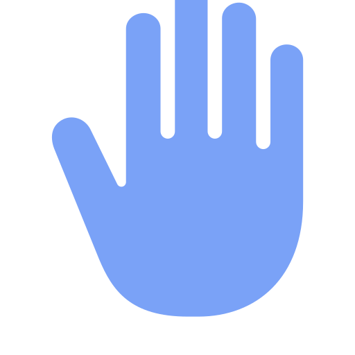
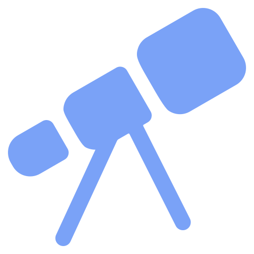
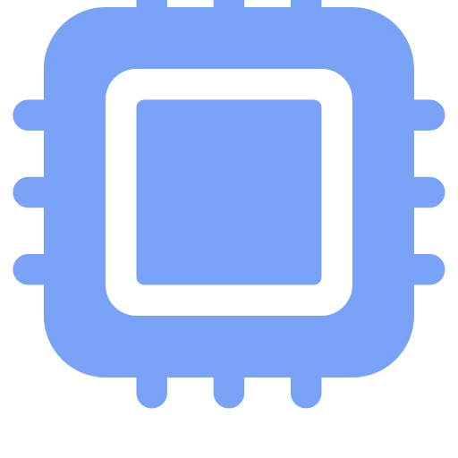
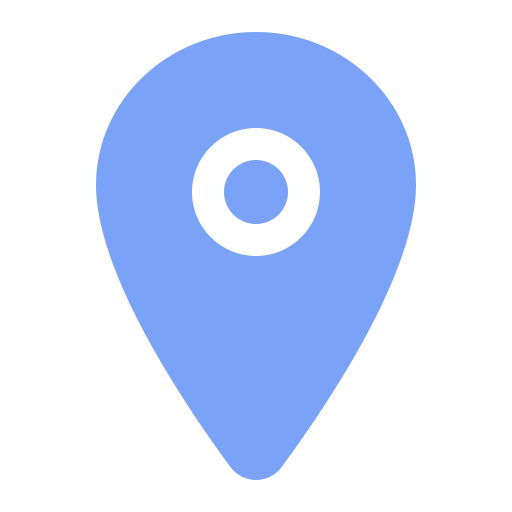
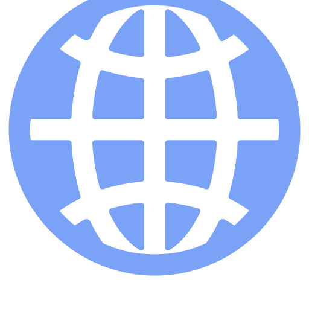
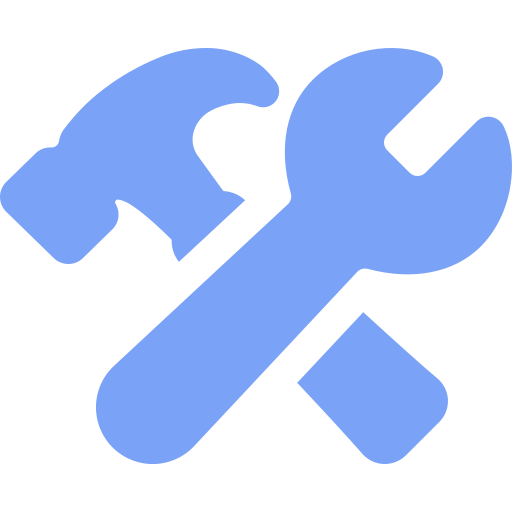
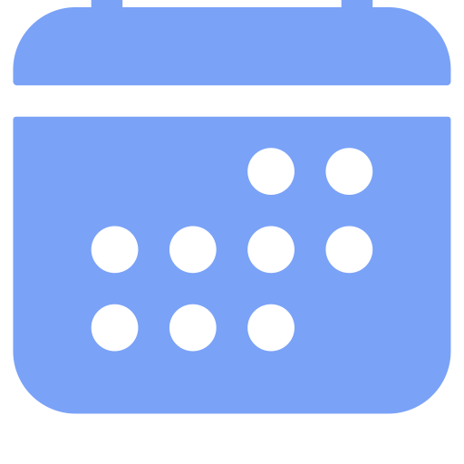

  
  
  
  

---

##  About me

-  Co-founder & CTO at [**Aturno**](https://aturno.ai): AI agents that research, draft and carry legal work from start to finish, for Czech and EU law
-  AI engineer at **Atollon**: agent pipelines and RAG, mostly in Python and Go
-  Building [**Speek**](https://github.com/aveekpatra/speek): a voice assistant for macOS that lives in the notch
-  Studying Informatics at the Czech University of Life Sciences Prague
-  Engineer with an artist's heart, heavily inspired by Jony Ive: the hard work should disappear
-  Prague, Czechia
-  Ask me about AI agents, RAG, legal tech, or making software feel simple

##  Things I've built

| | Project | What it is |
|---|---|---|
|  | [**Aturno**](https://aturno.ai) | AI workspace for lawyers: research, contract review, drafting, with citations you can check |
|  | [**Speek**](https://github.com/aveekpatra/speek) | Talk to your Mac. It listens, writes, and gets things done |
|  | [**Lexyos**](https://lexyos.com) | Keyboard-first tasks, projects and calendar with an AI agent |
|  | [**Renko**](https://renko.app) | AI domain name finder with live availability and prices |

##  Tech stack

**Languages**

**Frontend**

**Backend & infra**

##  Contributions

<a href="https://cdn.jsdelivr.net/gh/aveekpatra/aveekpatra@output/heatmap.svg" title="Open to hover any day">
  <picture>
    <source media="(prefers-color-scheme: dark)" srcset="https://raw.githubusercontent.com/aveekpatra/aveekpatra/output/heatmap.svg" />
    <source media="(prefers-color-scheme: light)" srcset="https://raw.githubusercontent.com/aveekpatra/aveekpatra/output/heatmap-light.svg" />
    
  </picture>
</a>
